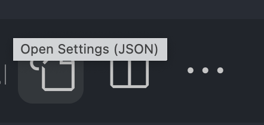

# SASS Syntactically Awesome Style Sheets

CSS on its own can be fun, but as your stylesheets get larger and more complex the harder it is to maintain. This is where a preprocessor can help. SASS gives you additional tools to help you to write and manage your css. SASS compiles to CSS.

## pre flight

1. you need a compiler: scss ==> css
1. we are using the live sass compiler for the Vs code extension
1. configure the extension settings => user.settings.json (for save output, extension name)
<!-- "liveSassCompile.settings.formats": [


    {

    "format": "expanded",

    "extensionName": ".css",

    "savePath": "/src/css/"

    }

    ], -->

1. compile scss turn on the LiveSass watch

cntrl + shift + p
live sass: watch

**SASS VS SCSS**  
There are two syntaxes available for SASS and SCSS. They are basically the same just written with a different syntax. One use the curly brace the other doesn't.

1. SCSS (Sassy CSS)

```scss
.selector {
  color: tomato;
}
```

1. SCSS (Sassy CSS)

```sass
  .selector
     color:tomato;

```

Everything you need to know about [sass basics](https://sass-lang.com/guide). Please read the documentation on the following topics.

## What You Need To Learn

1. Nesting
1. Variables
1. Partials
1. Modules
1. Extends/Inheritance
1. Mixins

## NPM Module

If your using SASS in a front end development project make sure that you install the sass npm modules.

```npm
  npm install -D sass
```

## VS Code Extensions

If your using SASS in side of VS code make sure to install the [Live Sass Compiler plugin.](https://marketplace.visualstudio.com/items?itemName=ritwickdey.live-sass)

You have to configure VS Code and the live sass compiler plugin.

1.  Go to gear icon and select setting from the pop up menu.
1.  In the search settings search for LiveSass  
    
1.  Copy the following code to the settings

```json
"liveSassCompile.settings.formats": [
   {
     "format": "expanded",
     "extensionName": ".css",
     "savePath": "~/../css/"
   }
 ],
```

1.  To run the LiveSass Compiler open the command palette (CTRL+Shift+P) and type the following command.

```
    LiveSass: Watch Sass

```

1. To turn the compiler off open the command palette (CTRL+Shift+P) and type the following command.

```
    LiveSass: Stop Watching

```
